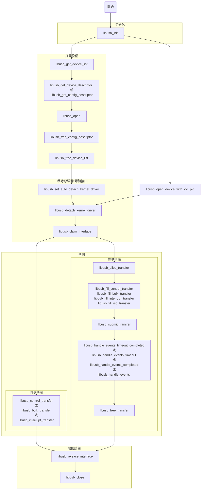

# 概述
* libusb為一個使用 C 寫的 lib 。可以透過它在 User space 來訪問 USB 設備。 不需要再編寫額外的驅動程式。
* 跨平台。 Linux 、 Windows 、Android 等等平台。
* 不需要 root 權限。
* 所有 USB 協議都支援。 1.0 ~ 3.1 。

# 用法

# Noted
* 在異步傳輸時。 程式要結束時，做 cleanup 動作可以對每個 transfer 呼叫 `libusb_cancel_transfer` 。程式會進到 call back function 中，且 transfer 的 status 不為 `LIBUSB_TRANSFER_COMPLETED` 。 此時可以做 error handling ，把 transfer free 掉即可安全的結束程式。 詳細流程可以參考 mouse_ctrl_test_async 。